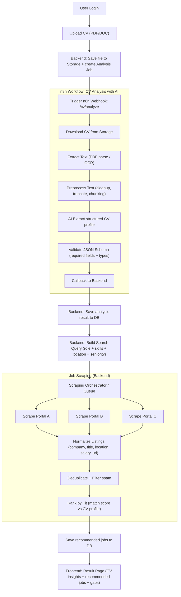

# System Architecture: CV Analysis & Job Recommendation

```mermaid
flowchart TB
    %% User Upload Flow
    A["User Login"] --> B["Upload CV (PDF/DOC)"]
    B --> C["Backend: Save file to Storage + create Analysis Job"]
    C --> D

    %% n8n Workflow
    subgraph N8N["n8n Workflow: CV Analysis with AI"]
        direction TB
        D["Trigger n8n Webhook: /cv/analyze"] --> E["Download CV from Storage"]
        E --> F["Extract Text (PDF parse / OCR)"]
        F --> G["Preprocess Text (cleanup, truncate, chunking)"]
        G --> H["AI Extract structured CV profile"]
        H --> I["Validate JSON Schema (required fields + types)"]
        I --> J["Callback to Backend"]
    end

    %% Process & Search Query
    J --> K["Backend: Save analysis result to DB"]
    K --> L["Backend: Build Search Query (role + skills + location + seniority)"]
    L --> M

    %% Scraping Workflow
    subgraph SCRAPE["Job Scraping (Backend)"]
        direction TB
        M["Scraping Orchestrator / Queue"] --> N["Scrape Portal A"]
        M --> O["Scrape Portal B"]
        M --> P["Scrape Portal C"]
        N --> Q["Normalize Listings (company, title, location, salary, url)"]
        O --> Q
        P --> Q
        Q --> R["Deduplicate + Filter spam"]
        R --> S["Rank by Fit (match score vs CV profile)"]
    end

    %% Storage & UI result
    S --> T["Save recommended jobs to DB"]
    T --> U["Frontend: Result Page (CV insights + recommended jobs + gaps)"]
```
